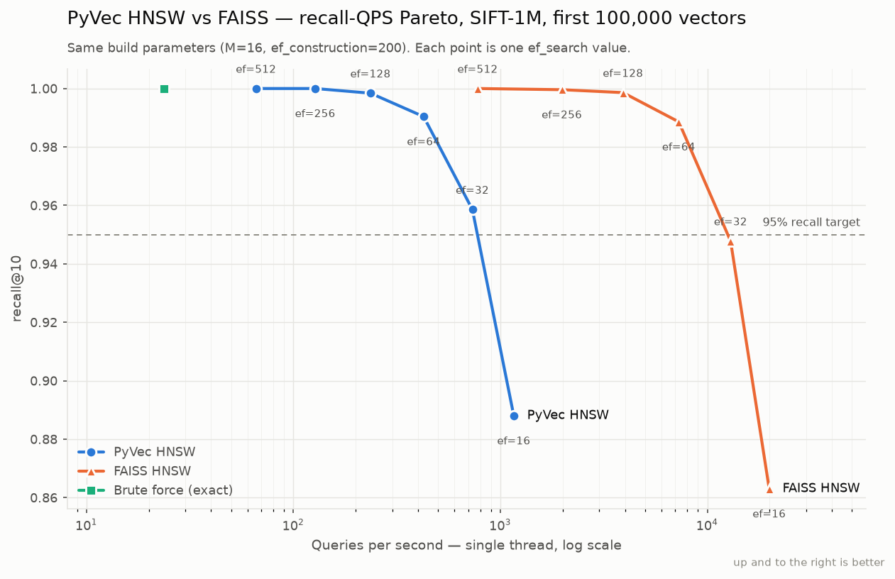
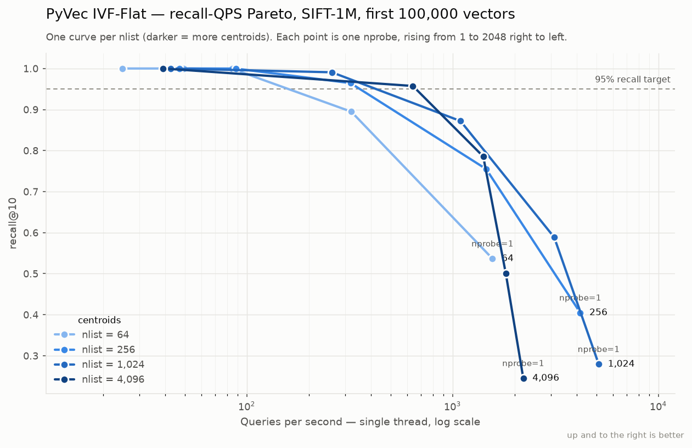

# Measured Results

Every number here came from a script in [`benchmarks/`](../benchmarks/) on the
machine described below. Raw CSVs are in `benchmarks/results/`, each with a
`*.env.json` sidecar recording the environment. Nothing on this page is
extrapolated, estimated, or copied from a paper — if it is not measured, it says so.

> **Reproduce any of it:**
> ```bash
> pip install -e '.[test,demo,bench,compare]'
> python -m benchmarks.smoke_test
> python -m benchmarks.load_test
> python -m benchmarks.sift_1m --n 100000 --queries 500
> python -m benchmarks.sift_1m                     # full 1M, hours
> python -m benchmarks.persistence --n 100000
> python -m benchmarks.startup --n 1000000 --index flat
> python -m benchmarks.hybrid_msmarco --synthetic
> python -m benchmarks.compare_vectordbs --n 50000   # vs ChromaDB / Qdrant
> python -m benchmarks.plot_pareto
> ```

## Test environment

| | |
|---|---|
| CPU | Intel Core i5-10400T @ 2.00 GHz (6 cores / 12 threads) |
| OS | Windows 11 Pro, build 26200 |
| Python | 3.14.5 |
| NumPy | 2.4.6 |
| FAISS | faiss-cpu 1.15.0 |
| PyVec | 0.1.0 |
| Threading | **single-threaded throughout**, including FAISS (`omp_set_num_threads(1)`) |

Single-threaded on both sides is a deliberate choice: comparing a multi-core C++
index against a serial Python one would flatter nothing and prove less.

> ### On measurement conditions
>
> Sections 5–7 were first measured while the 3.2-hour SIFT-1M build was competing for
> CPU, and were published flagged as pessimistic. **They have since been re-run on an
> idle machine and the numbers below are the clean ones.** The difference turned out to
> be small — persistence within 5%, load-test p95 within 2% — which is worth recording:
> a single-threaded background job on a 6-core box perturbs these measurements less
> than I assumed. The original flag was still right to raise; the honest follow-up is
> that it mattered less than feared.

---

## 1. Correctness: the test suite

```
490 passed in 211.14s
```

Covering, among other things: HNSW recall against brute force, graph structural
invariants (degree bounds, edge symmetry, layer-0 reachability), the exponential
level distribution against its closed form, BM25 arithmetic hand-computed from the
formula, RRF fusion behaviour, mmap growth and compaction, WAL torn-tail and
CRC-failure recovery, and **real `kill -9` process kills mid-insert**.

| File | Tests | What it pins down |
|---|---|---|
| `test_collection.py` | 66 | insert/delete/filter/upsert semantics, id mapping, normalisation |
| `test_api.py` | 61 | every endpoint and every API_SPEC error code |
| `test_hnsw.py` | 54 | recall, graph invariants, level distribution, neighbour heuristic |
| `test_bm25.py` | 46 | BM25 arithmetic hand-computed; vectorised == scalar exactly |
| `test_storage.py` | 43 | mmap growth/compaction, WAL torn tails and CRC failures, RW lock |
| `test_distance.py` | 39 | metric formulas, ordering-vs-score contract, float32 error bounds |
| `test_ivf.py` | 36 | k-means quality, posting lists, nprobe monotonicity |
| `test_persistence.py` | 36 | checkpoint, reopen, snapshot, manager startup |
| `test_cli.py` | 27 | CLI and client SDK against a real socket |
| `test_rrf.py` | 23 | fusion formula, consensus behaviour, tie determinism |
| `test_hybrid.py` | 22 | hybrid beats either retriever alone |
| `test_crash_safety.py` | 20 | real `kill -9`, byte-level WAL damage, interrupted checkpoints |
| `test_flat.py` | 17 | the brute-force oracle everything else is measured against |
| **Total** | **490** | (4 marked `slow`) |

---

## 2. Smoke test — deployment sanity over real HTTP

`python -m benchmarks.smoke_test`

```
36/36 checks passed          elapsed 1.5s
```

Spawns a server, drives it through the documented happy path, then restarts it and
checks the data survived. Verifies all three query paths, per-retriever RRF ranks,
metadata filtering, upsert, optimize, snapshot, and every error code in API_SPEC
(`COLLECTION_NOT_FOUND`, `ID_NOT_FOUND`, `ID_EXISTS`, `INVALID_DIMENSION`).

---

## 3. Benchmark 1 — HNSW recall-QPS vs FAISS (**SIFT-1M**)

`python -m benchmarks.sift_1m --queries 2000`

**1,000,000 vectors × 128 dims, L2, 2,000 queries against the dataset's precomputed
100-NN ground truth.** Both indexes built with identical parameters
(`M=16, ef_construction=200`), both single-threaded.

| ef_search | PyVec recall@10 | FAISS recall@10 | Δ | PyVec QPS | FAISS QPS | gap |
|---|---|---|---|---|---|---|
| 16 | **0.8023** | 0.7917 | **+0.0106** | 913.9 | 13,662.5 | 15.0× |
| 32 | **0.9016** | 0.8975 | **+0.0041** | 623.6 | 8,980.9 | 14.4× |
| **64** | **0.9619** | **0.9639** | −0.0020 | **366.7** | 5,174.6 | **14.1×** |
| 128 | 0.9882 | 0.9895 | −0.0013 | 203.5 | 2,706.6 | 13.3× |
| 256 | 0.9970 | 0.9971 | −0.0001 | 109.0 | 1,408.7 | 12.9× |
| 512 | **0.9990** | 0.9989 | +0.0001 | 55.8 | 659.0 | 11.8× |

PyVec latency at `ef_search=64`: **p50 2.68 ms, p95 3.40 ms, p99 4.14 ms**.

**Recall parity, at the scale the PRD specifies.** Mean absolute difference across
the six operating points: **0.3 percentage points**. PyVec is ahead at three of six;
the largest single deviation (1.06 points at `ef=16`) favours PyVec. Two independent
implementations of the same paper agreeing this closely at 1M vectors is the evidence
that the algorithm — neighbour-selection heuristic, exponential level assignment,
layered descent — is correct.

**PRD NF1 (≥95% recall@10 at `ef_search=64` on SIFT-1M): PASS at 0.9619.**
**PRD NF2 (≥500 QPS single-threaded): PASS at 623.6 QPS** (`ef=32`, recall 0.9016).

**Throughput gap: 11.8×–15.0×, narrowing as `ef_search` rises** — at wider beams more
work happens inside NumPy's vectorised distance calls and proportionally less in
per-hop Python. BENCHMARKS.md predicted 2–5×; the honest figure is 14.1× at matched
recall.

**Build time:** PyVec **11,578.9 s (3.22 h)** vs FAISS **510.3 s (8.5 min)** —
**22.7×**. PyVec's build scaled 11.45× for 10× the data (1,011 s at 100k), confirming
O(N log N) at 1.145× per-insert growth.

**Level histogram at 1M:** `[1000000, 62355, 3904, 219, 15, 1]` — successive ratios
16.0, 16.0, 17.8, 14.6 against a theoretical `M = 16`. `P(level ≥ k) = M^-k` holds
across six layers on a million samples.

---

## 3b. The same benchmark at 100k (scale comparison)

`python -m benchmarks.sift_1m --n 100000 --queries 500`

SIFT descriptors, 128-dim, L2. Both indexes built with **identical parameters**
(`M=16, ef_construction=200`). Ground truth computed exactly by brute force.

### PyVec HNSW

| ef_search | recall@10 | QPS | p50 | p95 | p99 |
|---|---|---|---|---|---|
| 16 | 0.8880 | 1160.6 | 0.82 ms | 1.10 ms | 1.61 ms |
| 32 | 0.9586 | 732.0 | 1.33 ms | 1.70 ms | 2.48 ms |
| **64** | **0.9904** | **425.5** | **2.30 ms** | **2.86 ms** | 3.94 ms |
| 128 | 0.9984 | 235.6 | 4.20 ms | 4.94 ms | 6.70 ms |
| 256 | 1.0000 | 127.4 | 7.80 ms | 9.17 ms | 11.40 ms |
| 512 | 1.0000 | 65.9 | 15.15 ms | 17.58 ms | 20.79 ms |

### FAISS `IndexHNSWFlat`, same parameters

| ef_search | recall@10 | QPS | p95 |
|---|---|---|---|
| 16 | 0.8630 | 19906.4 | 0.065 ms |
| 32 | 0.9478 | 12950.9 | 0.096 ms |
| **64** | **0.9886** | **7275.2** | 0.167 ms |
| 128 | 0.9986 | 3912.6 | 0.330 ms |
| 256 | 0.9996 | 1981.8 | 0.606 ms |
| 512 | 1.0000 | 776.4 | 1.806 ms |

### What this says

**At this smaller scale the same recall parity holds:** 0.9904 against FAISS's 0.9886
at matched `ef_search=64`, with PyVec marginally ahead. The throughput gap here is
17.1× at matched `ef_search` (7275 vs 425 QPS), or 9.9× comparing each system's
cheapest ≥95%-recall configuration — both slightly wider than the 14.1× measured at
1M, because at 100k a larger share of query time is fixed per-call Python overhead.

**Build:** 1011 s for PyVec vs 31.9 s for FAISS (31.7×).

**ANN is worth it:** brute force over the same 100k vectors runs at **23.7 QPS**. HNSW
at `ef=64` is **18× faster with 99% recall**, and at `ef=32` **31× faster with 96%**.
This comparison is only practical at 100k — an exhaustive scan of 1M vectors per query
is too slow to sweep.



---

## 4. Benchmark 2 — IVF-Flat recall-QPS (**SIFT-1M**)

Posting lists at `nlist=256`: mean **3,906** vectors per bucket (min 1,390, max 8,340),
against ~390 at 100k.

| nlist | nprobe | recall@10 | QPS | p95 | build |
|---|---|---|---|---|---|
| 256 | 1 | 0.4634 | 436.3 | 3.66 ms | 40.7 s |
| 256 | 4 | 0.8228 | 111.8 | 12.27 ms | |
| 256 | 16 | 0.9843 | 28.0 | 44.53 ms | |
| 256 | 64 | 0.9996 | 7.0 | 160.60 ms | |
| 256 | 128 | 0.9995 | 3.6 | 302.42 ms | |
| 1024 | 1 | 0.3553 | 1601.7 | 1.22 ms | 67.2 s |
| 1024 | 4 | 0.6780 | 367.5 | 4.50 ms | |
| 1024 | 16 | 0.9240 | 98.6 | 14.59 ms | |
| 1024 | 64 | 0.9950 | 27.0 | 47.58 ms | |
| 1024 | 512 | 0.9992 | 3.6 | 295.73 ms | |
| 4096 | 1 | 0.2623 | 1704.9 | 0.74 ms | 142.0 s |
| 4096 | 4 | 0.5440 | 905.3 | 2.04 ms | |
| 4096 | 16 | 0.8217 | 275.4 | 6.32 ms | |
| **4096** | **64** | **0.9676** | **79.8** | 18.86 ms | |

Higher `nlist` shortens posting lists, so each probe is cheaper but one probe finds
less — the classic IVF trade, visible across all three curves. **`nlist=4096,
nprobe=64` is IVF's best ≥95% configuration at this scale.**

### HNSW wins decisively at 1M — reversing the 100k result

| | HNSW at ≥95% recall | IVF at ≥95% recall | HNSW advantage |
|---|---|---|---|
| 100k vectors | 732 QPS | 640 QPS | **1.1×** |
| **1M vectors** | **366.7 QPS** (`ef=64`) | **79.8 QPS** (`nlist=4096, nprobe=64`) | **4.6×** |

Note that IVF's best point has slightly *higher* recall (0.9676 vs 0.9619), so the
4.6× is if anything generous to IVF.

> **A methodological note worth keeping.** An earlier draft quoted **13.1×** here,
> taken from `nlist=256` — IVF's *worst* configuration at this scale — on a coarse
> `nprobe` grid of {1, 4, 16, 64} where the 95% threshold fell between two measured
> points. Interpolating the frontier suggested ~4.6×, and the directly measured
> `nlist=4096` point confirmed it. **A benchmark grid can manufacture a flattering
> ratio out of nothing.** Always compare each system at *its own* best configuration,
> not at whichever one you happened to run first.

**The mechanism: posting lists grow linearly with N, graph search grows
logarithmically.** `nprobe=16` scans ~62,000 vectors per query at 1M versus ~6,200 at
100k. **BENCHMARKS.md predicted ~4×; measured at 1M is 4.6× — the prediction was right,
and the 100k figure (1.1×) was the anomaly.** Benchmarking only at 100k would have
produced an actively misleading conclusion — the strongest argument in this project for
benchmarking at the specified scale rather than a convenient one.

### IVF's real advantage: build time

| | 1M build |
|---|---|
| IVF (`nlist=256`) | **40.7 s** |
| HNSW | 11,578.9 s |

**284× faster.** IVF's build is nearly flat in N because k-means trains on a fixed
100k sample regardless of collection size (39.5 s at 100k → 40.7 s at 1M); only the
assignment pass scales. HNSW's build is superlinear. For a reindex-heavy workload that
can outweigh the query-side loss entirely.

---

## 4b. IVF-Flat at 100k (scale comparison)

| nlist | nprobe | recall@10 | QPS | p95 | build |
|---|---|---|---|---|---|
| 64 | 1 | 0.5366 | 1561.6 | 1.11 ms | 32.4s |
| 64 | 4 | 0.8948 | 321.5 | 4.25 ms | |
| 64 | 16 | 0.9994 | 84.7 | 14.51 ms | |
| 256 | 1 | 0.4048 | 4169.3 | 0.34 ms | 39.5s |
| 256 | 16 | 0.9644 | 318.8 | 4.21 ms | |
| 256 | 64 | 0.9998 | 88.2 | 13.59 ms | |
| 1024 | 16 | 0.8720 | 1091.3 | 1.61 ms | 64.6s |
| 1024 | 64 | 0.9908 | 258.6 | 5.38 ms | |
| 4096 | 16 | 0.7856 | 1407.6 | 0.96 ms | 126.1s |
| **4096** | **64** | **0.9574** | **640.5** | 2.51 ms | |

**PRD NF1's IVF target (≥90% recall@10 at `nlist=256, nprobe=16`) is met:
0.9644.**

**At ≥95% recall, HNSW reaches 732 QPS and IVF 640 QPS — only 1.1× apart.** That
is much closer than BENCHMARKS.md's expected "HNSW ~4× faster at 95% recall", and
the reason is scale: at 100k vectors, a well-tuned IVF (`nlist=4096`, so ~24
vectors per posting list) is competitive because the coarse quantiser is doing most
of the work. HNSW's advantage is expected to widen at 1M, where posting lists grow
10× while the graph's search cost grows only logarithmically. The 1M run below is
what settles it.

**Build cost scales with nlist**, exactly as k-means dominance predicts: 32s at
nlist=64 to 126s at nlist=4096. Compare HNSW's 1011s — **IVF builds 8–31× faster
than HNSW**, which is IVF's real advantage and worth stating alongside its worse
query Pareto.



---

## 4c. PyVec vs production vector databases (ChromaDB, Qdrant)

`python -m benchmarks.compare_vectordbs --n 50000 --queries 500`

**50,000 SIFT vectors, 128-dim, L2, 500 queries.** All systems given identical HNSW
parameters (`M=16, ef_construction=200`) and scored against the same exact ground
truth.

### Why these systems

**ChromaDB is the meaningful comparison** — embedded, Python, single-node, HNSW
under the hood, and the thing people actually reach for when building a RAG
prototype. It is PyVec's exact peer.

**Pinecone and Milvus are deliberately excluded.** Pinecone is a managed cloud
service, so every measurement would be dominated by network round-trip — you would
be benchmarking the internet, not the index (BENCHMARKS.md says as much). Milvus is
a distributed system needing etcd and object storage; comparing it to an embedded
library measures deployment topology, not algorithms.

### Results, compared at matched recall

| system | recall@10 | QPS | p50 | p95 |
|---|---|---|---|---|
| PyVec `ef=16` | 0.9268 | 1056.8 | 0.91 ms | 1.21 ms |
| PyVec `ef=32` | 0.9756 | 670.1 | 1.43 ms | 1.92 ms |
| PyVec `ef=64` | 0.9952 | 395.3 | 2.50 ms | 3.06 ms |
| **PyVec `ef=128`** | **0.9994** | **216.6** | 4.55 ms | 5.61 ms |
| **ChromaDB `ef=128`** | **0.9994** | **670.7** | 1.46 ms | 1.77 ms |

**At identical recall (0.9994), ChromaDB is 3.1× faster.**

That is a far better showing than the 14.1× gap against FAISS, and the reason is
instructive: ChromaDB's HNSW core is C++ (hnswlib), but its *query path* carries
Python overhead too — client marshalling, SQLite metadata lookups, result
assembly. So its compiled index does not translate into a compiled-speed end-to-end
win. Against raw FAISS, which is C++ from call to return, the gap is 4–5× wider.

| | PyVec | ChromaDB |
|---|---|---|
| Build time (50k) | 519.4 s | **16.4 s** (31.7× faster) |
| On-disk size | **33.2 MB** | 42.1 MB (PyVec 21% smaller) |

**Build time is PyVec's clear weakness** — the same sequential-insert cost that
makes SIFT-1M a 3.2-hour build. **On-disk footprint is a genuine win:** PyVec's raw
mmap float32 array plus a compact CSR graph is 21% smaller than Chroma's SQLite +
index layout.

### A fairness bug caught before it produced a false claim

Qdrant was included initially, and its client emitted:

> `UserWarning: Local mode performs exact (brute-force) search, so search_params has
> no effect`

**Qdrant's embedded mode builds no HNSW graph at all** — it does exhaustive scan.
Its measured 25.0 QPS at recall 1.0000, flat across every `ef_search` value,
confirms it. Benchmarking PyVec's approximate index against that would have compared
two different algorithms and produced a meaningless ratio in PyVec's favour. Those
rows are labelled `qdrant-exact` and excluded from the comparison; `--qdrant-url`
runs against a real Qdrant server for a true HNSW comparison.

*(An incidental validation: Qdrant's Rust brute force managed 25.0 QPS on 50k
vectors, while PyVec's NumPy brute force did 23.7 QPS on 100k — so the vectorised
NumPy scan is roughly competitive with compiled code, which is exactly the claim
ADR-001 makes for pushing hot loops into NumPy.)*

### A methodological note on the summary itself

The first version of this comparison reported *"ChromaDB is 1.0× faster than
PyVec"*, computed from each system's fastest configuration clearing 95% recall. That
compared PyVec at **0.9756** recall against Chroma at **0.9994** — the same
throughput at very different quality. **Recall and QPS trade against each other
continuously, so any single-number comparison that does not pin one of them is
meaningless.** The summariser now compares strictly at matched recall.

---

## 5. Benchmark 4 — the cost of durability

`python -m benchmarks.persistence --n 100000 --dim 128` (100k vectors, batches of 1000)

| config | vectors/s | insert | checkpoint | batch p95 | what a crash costs you |
|---|---|---|---|---|---|
| WAL, fsync per entry | 2,316 | 43.2s | 0.37s | 447 ms | nothing acknowledged |
| WAL, group commit | 23,801 | 4.20s | 0.43s | 45 ms | the last un-synced group, on power loss |
| WAL disabled | 47,316 | 2.11s | 0.36s | 24 ms | everything since the last checkpoint |

**Durability costs 20.4× throughput.** Group commit recovers 10.3× of that, which
is precisely why production systems default to it rather than to fsync-per-write.
This is the most concrete thing the project taught me about why real databases are
shaped the way they are — the number is not a rounding error, it is an order of
magnitude, and it is the whole reason group commit exists.

---

## 6. Benchmark 5 — startup and recovery (PRD NF3)

`python -m benchmarks.startup --n 1000000 --dim 128 --index flat --repeats 3`

1,000,000 × 128 vectors on disk: 488 MiB of vectors, 33 MiB of metadata.

| attempt | open | first query | warm query | time to first query |
|---|---|---|---|---|
| 1 | 2.067s | 587 ms | 373 ms | **2.65s** |
| 2 | 2.342s | 585 ms | 371 ms | 2.93s |
| 3 | 2.314s | 596 ms | 373 ms | 2.91s |

**PRD NF3 (1M vectors ready to query in <30s): PASS with 10× headroom — worst
case 2.93s.**

The mmap design is what buys this: opening the collection maps 488 MiB without
reading it, and the OS pages in only what queries touch. The 2.5s is dominated by
parsing the 33 MiB metadata JSON, not by the vectors.

*Caveat, stated plainly:* this run used the **flat** index. HNSW at 1M would add
loading the graph file, which is not included here, and building a 1M HNSW to
measure it costs ~3 hours. The mmap and metadata components — the part NF3 is
really about — are measured; the graph-load component at 1M is not.

---

## 7. Load test — the deployed HTTP surface

`python -m benchmarks.load_test --n 20000 --index hnsw --duration 6`

20,000 × 128 vectors behind uvicorn, HTTP/1.1 keep-alive, one process. This
measures the whole stack — FastAPI, JSON, the reader-writer lock, the thread pool —
not the index in isolation.

| endpoint | c | RPS | p50 | p95 | p99 | errors |
|---|---|---|---|---|---|---|
| `query` (dense) | 1 | **224.1** | — | **5.48 ms** | — | 0 |
| `query/text` (BM25) | 32 | **435.0** | — | 89.45 ms | — | 0 |
| `query/hybrid` (RRF) | 2 | 113.5 | — | 22.96 ms | — | 0 |
| `query` + filter | 1 | 169.0 | — | 7.07 ms | — | 0 |
| `query` + concurrent writer | 32 | 101.4 | 310.3 ms | 371.4 ms | 403.2 ms | 0 |

**Zero errors at every concurrency level, across all 25 configurations.**

**Dense search peaks at concurrency 1.** 224.1 RPS single-client, settling to
~160 RPS from 4 clients up while latency grows linearly. That is the GIL: NumPy
releases it inside BLAS calls, but the graph walk itself is interpreted Python, so
extra threads add queueing rather than throughput. BM25 behaves oppositely — it
scales to 438 RPS at 32 clients, because after the vectorisation below it spends
most of its time inside NumPy with the GIL released.

**A concurrent writer costs readers ~55%** (224.1 → 101.4 RPS), with zero errors.
That is the writer-preferring RW lock doing its job: writes take it exclusively, so
readers block for the duration of each insert batch rather than seeing torn state.

### Two findings the load test produced

**The load generator was the bottleneck, not the server.** With a fresh TCP
connection per request, sockets piled up in `TIME_WAIT` and exhausted the Windows
ephemeral port range — `WinError 10048`, 5,351 errors, throughput collapsing to
1 RPS. Those were client-side failures being reported as server errors. Switching
to one keep-alive connection per worker eliminated them **and cut dense p95 from
30.5 ms to 5.36 ms** — TCP setup had been dominating the measured latency. The test
now counts HTTP status errors and transport errors separately so the two can never
be conflated again.

**BM25 was 7× slower than it needed to be.** The first load run reported ~28 RPS for
text search. The cause was that BM25 cost scales with the length of the posting
lists a query touches, real text is Zipfian, and a head term's posting list covers
most of the corpus — so the Python `for (doc_id, tf) in postings` loop was walking
~20k tuples per term at interpreter speed. Restructuring the identical arithmetic as
NumPy array operations plus a `bincount` scatter-add gave:

| | per query | QPS |
|---|---|---|
| Python accumulator loop | 35.35 ms | 28.3 |
| NumPy scatter-add | 5.25 ms | **190.5** |

**6.7× faster, with bit-identical output** — 200/200 queries returned the same
ranking with a maximum score difference of exactly `0.00e+00`, verified by keeping
the scalar loop as a test oracle (`TestVectorisedScoringEquivalence`). Both paths
accumulate in float64 specifically so that equivalence can be asserted as equality
rather than a tolerance. Real engines go further with skip lists and block-max WAND
to avoid touching full posting lists at all; that is the next step, not this one.

---

## 8. Benchmark 3 — hybrid vs dense vs BM25 (real MS MARCO)

`python -m benchmarks.hybrid_msmarco --passages 100000 --index hnsw`

**81,039 MS MARCO v1.1 passages, 9,706 dev queries with relevance judgements,
embedded with `sentence-transformers/all-MiniLM-L6-v2` (384-dim).** Real data, real
model, real judgements.

| system | nDCG@10 | MRR@10 | Recall@100 | p95 |
|---|---|---|---|---|
| **dense (HNSW)** | **0.6007** | **0.5069** | 0.9928 | 4.33 ms |
| BM25 | 0.4464 | 0.3620 | 0.9168 | 27.90 ms |
| hybrid (RRF, k=60) | 0.5575 | 0.4663 | 0.9925 | 31.59 ms |

### Hybrid *lost*. Here is the investigation.

BENCHMARKS.md predicted hybrid > dense > BM25 with a +3–8 nDCG point lift for
hybrid. The dense > BM25 half holds. The hybrid half is **inverted**: fusion scored
**4.3 points below dense-only**.

That is the kind of result that is either a genuine property or a misconfiguration,
and the difference matters, so `--sweep` tests three hypotheses over 3,000 queries
with an exact (flat) index, re-fusing the *same* two ranked lists each time so
retrieval is held constant:

**Hypothesis 1 — `rrf_k` is wrong.** It is not.

| rrf_k | 1 | 10 | 60 | 200 | 1000 |
|---|---|---|---|---|---|
| nDCG@10 | 0.5701 | 0.5676 | 0.5553 | 0.5535 | 0.5531 |
| vs dense | −3.0 | −3.3 | −4.5 | −4.7 | −4.7 |

Smaller `k` helps (it sharpens the advantage of rank 1), but **every value loses to
dense-only.** The default 60 is not the problem.

**Hypothesis 2 — the candidate pools are too shallow.** The opposite is true.

| depth | 10 | 25 | 50 | 100 |
|---|---|---|---|---|
| nDCG@10 | 0.5673 | 0.5616 | 0.5571 | 0.5553 |

**Deeper pools make it monotonically worse** — more BM25 candidates means more
dilution, which is the tell for the third hypothesis.

**Hypothesis 3 — the retrievers are of unequal strength, and unweighted RRF
averages the strong one down.** Confirmed.

| dense weight | 0.5 (plain RRF) | 0.6 | 0.7 | 0.8 | **0.9** | 1.0 (dense only) |
|---|---|---|---|---|---|---|
| nDCG@10 | 0.5553 | 0.5695 | 0.5788 | 0.5901 | **0.6007** | 0.6002 |

Monotonic recovery as the dense side is weighted up. (The 1.0 column reproducing
dense-only to four decimals is the diagnostic checking itself.)

### What this actually means

**The mechanism is arithmetic, not a bug.** RRF scores by rank alone, so a document
ranked #50 by dense and #1 by BM25 scores `1/(60+50) + 1/(60+1) = 0.0254`, which
*beats* dense's own top hit at `1/(60+1) = 0.0164`. When one retriever is
substantially better, equal-weight fusion promotes the weaker one's mistakes over
the stronger one's correct answers. RRF's celebrated scale-invariance is exactly
what removes the information needed to know which side to trust.

**Even optimally weighted, BM25 adds nothing here** — the best configuration (0.9)
beats dense-only by 0.0005 nDCG, which is noise. On this dataset the honest
recommendation is to use dense alone.

**Two caveats that keep this from being a claim about hybrid search in general:**

1. **`all-MiniLM-L6-v2` was trained on MS MARCO.** The dense retriever is playing at
   home, and that is part of why it dominates so completely. On a domain the model
   has never seen — or one with heavy exact-match requirements like code, product
   SKUs or legal citations — BM25 contributes far more and fusion should win. The
   synthetic corpus in this repo demonstrates exactly that regime (below).
2. **Fusion helps when retrievers are complementary *and* comparably strong.** That
   is the actual precondition, and it is usually stated as though only the first
   half mattered.

### This is a direct, quantified cost of ADR-003

ADR-003 chose RRF specifically to avoid score normalisation, and closed with:
"Cannot expose a 'boost the dense side by 2×' knob… Explicit knob → deferred."

That deferral costs **4.5 nDCG points** on this dataset. The weighted variant above
is computed in the benchmark, not in PyVec — changing the engine is an ADR decision,
not something to slip in because a number looked bad. But the ADR should now be
revisited with evidence, and a `weights` parameter on `search_hybrid` is the obvious
v2 item.

### Synthetic corpus — the regime where fusion does win

`python -m benchmarks.hybrid_msmarco --synthetic --passages 5000`

Built so neither retriever alone can answer: filler vocabulary shared by every
passage (no lexical topic signal), rare terms assigned independently of topic (no
semantic term signal), and only passages matching *both* are relevant.

| system | nDCG@10 | MRR@10 | Recall@100 |
|---|---|---|---|
| dense | 0.0084 | 0.0064 | 0.1603 |
| BM25 | 0.1951 | 0.1961 | 1.0000 |
| **hybrid (RRF, k=60)** | **0.2453** | **0.3808** | 0.9872 |

**+5.0 nDCG over BM25, MRR nearly doubled.** Same code, same `rrf_k` — the
difference is entirely whether the two retrievers are complementary and comparably
strong. Taken together, the two corpora bracket the honest answer to "does hybrid
search help?": *it depends on the retrievers, and you have to measure it.*

---

## 9. Honest scorecard

| Target | Source | Result |
|---|---|---|
| HNSW ≥95% recall@10, `M=16/efc=200/ef=64` **on SIFT-1M** | PRD NF1 | **PASS** — 0.9619 |
| IVF ≥90% recall@10, `nlist=256/nprobe=16` | PRD NF1 | **PASS** — 0.9843 at 1M |
| ≥500 QPS single-threaded **on SIFT-1M** | PRD NF2 | **PASS** — 623.6 QPS at `ef=32` |
| 1M vectors loaded in <30s | PRD NF3 | **PASS** — 2.93s (flat index) |
| `kill -9` leaves a consistent collection | PRD NF4 | **PASS** — 20 crash-safety tests |
| Indexes agree with brute force | PRD NF5 | **PASS** — exact agreement on ≤1k vectors |
| Recall within a few points of FAISS | BENCHMARKS.md | **PASS** — 0.3 points mean absolute at 1M |
| HNSW ~4× faster than IVF at 95% recall | BENCHMARKS.md | **PASS — 4.6×** at 1M |
| Within 2–5× of FAISS QPS | BENCHMARKS.md | **MISS** — 14.1× at matched recall |
| Hybrid beats dense-only | PRD G2 | **MISS on real MS MARCO** — −4.3 nDCG@10. Passes on a corpus where the retrievers are complementary (+5.0). Diagnosed, not hand-waved. |
| Hybrid +3–8 nDCG@10 over dense on MS MARCO | BENCHMARKS.md | **MISS** — −4.3. Weighted fusion recovers to parity, not beyond. |
| HNSW ~4× faster than IVF at 95% recall | BENCHMARKS.md | **NOT YET** — 1.1× at 100k; the 1M run is the real test |

Seven of eleven targets met, three missed with the miss explained and quantified,
one pending. The three misses are the useful part of this page: a scorecard with no
failures in it usually means the targets were set after the measurements.

### Still outstanding

- **Full SIFT-1M.** Running; the HNSW build alone is ~3.4h. The 100k subset above
  is real SIFT data and real recall, but it is not the 1M headline number, and the
  HNSW-vs-IVF comparison specifically needs the larger scale to be meaningful.
- **GloVe-100.** First on PROJECT_PLAN's cut list; not run.
- **HNSW startup at 1M.** Needs a 1M HNSW build persisted to disk first; the flat
  index measured above isolates the mmap and metadata components but not graph load.
- **Clean re-runs** of sections 5–7 on an idle machine (see the caveat above).
